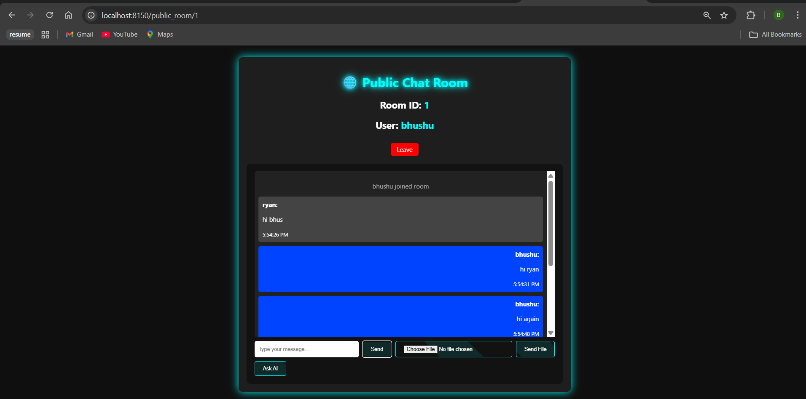
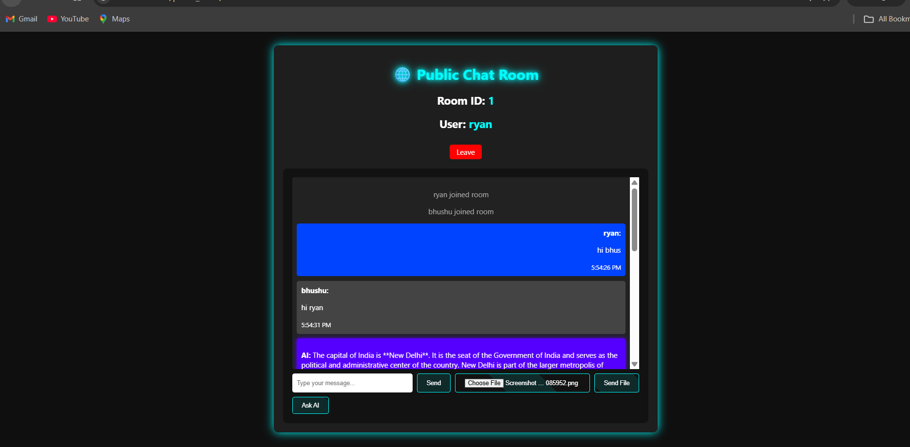
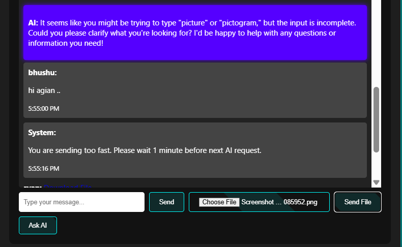
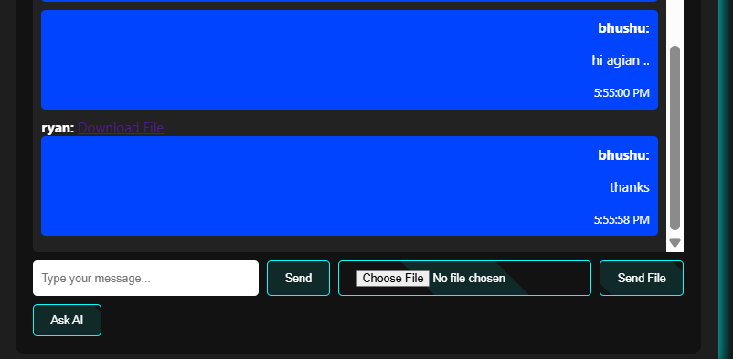
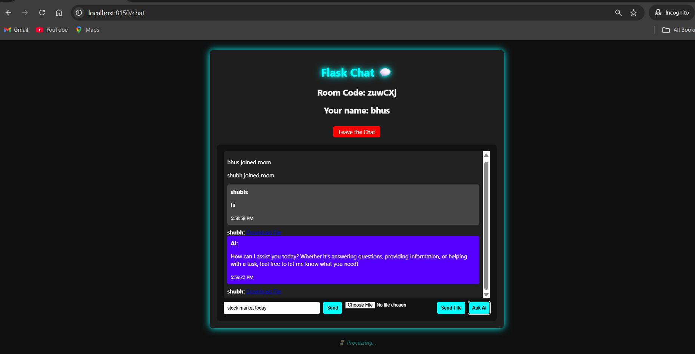
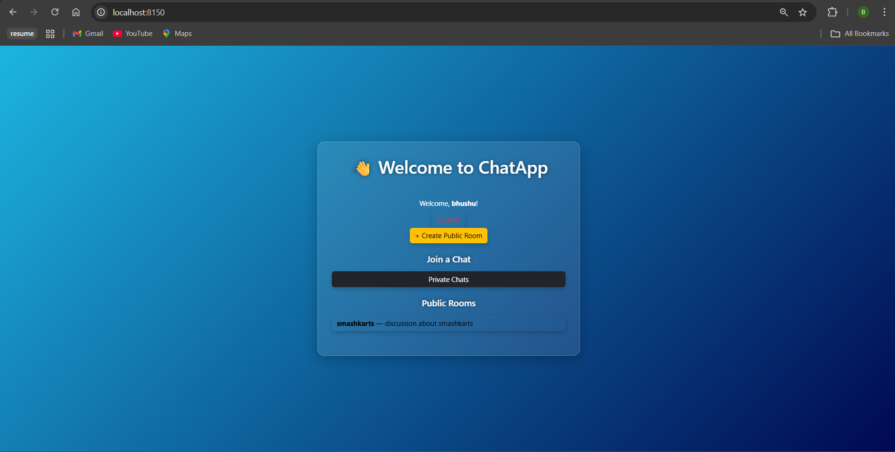
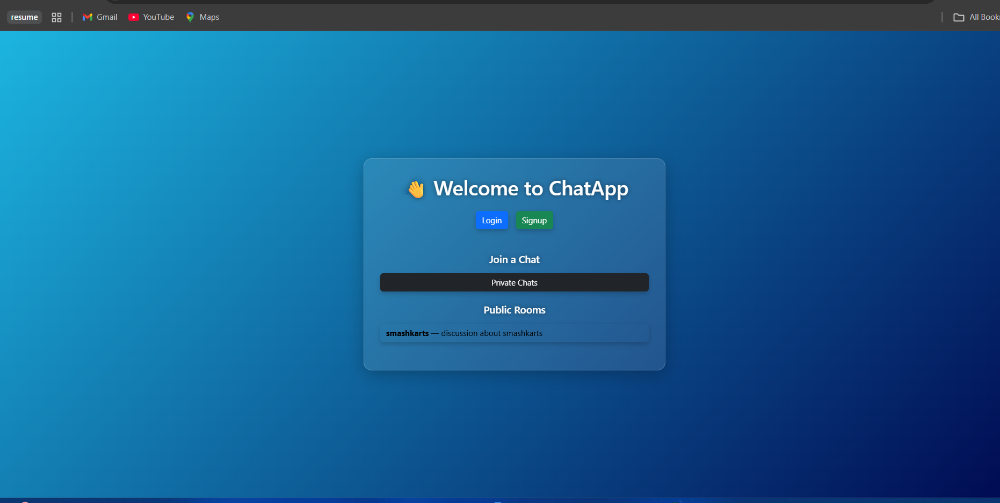
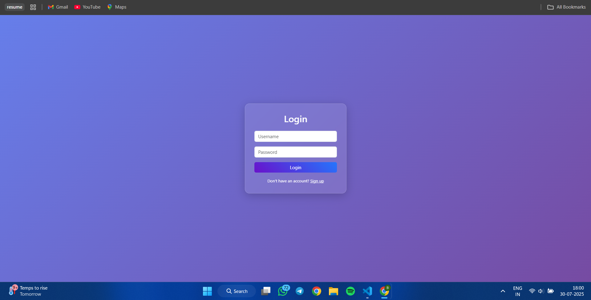
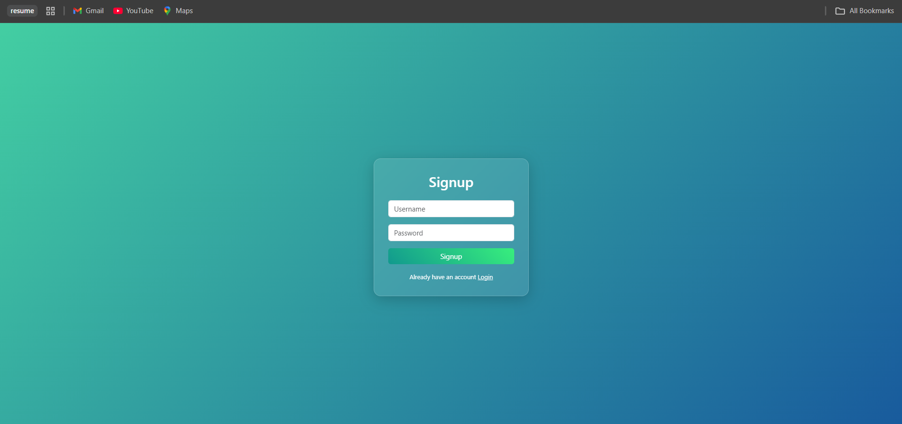
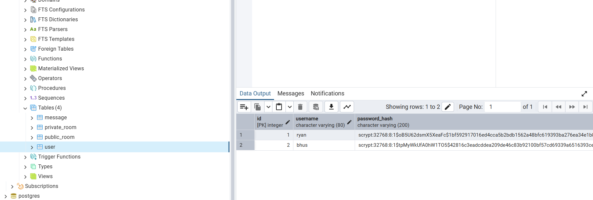

# ChitChat - Reatlime Chat Application

ChitChat is a real-time AI-powered chat platform offering dynamic public and private rooms, smart AI conversations, and enhanced security with CSRF, XSS protection, and rate limiting — all in a sleek microservices setup.


## Features

- 🌐 Real-time messaging (public & private rooms)


- 🤖 AI-powered chatbot integration (via Cohere API)
- 🔐 CSRF & XSS protection
- 🚫 Rate limiting to prevent spam
- 🧠 Redis caching for fast data access
- 🧱 Dockerized microservices for easy deployment
- 📱 Responsive UI with Bootstrap styling


## 🧩 Architecture

ChitChat follows a **microservices architecture** using Docker. Below is a breakdown of the core components and how they interact:

- **Frontend & Backend (Flask)**: Manages user interface, authentication, and real-time chat via Socket.IO.
- **AI Service (Flask)**: A separate container that communicates with the Cohere API to generate AI-powered responses.
- **PostgreSQL**: Stores user data, chat history, and room details.
- **Redis**: Used as a caching layer to optimize performance and session management.
- **Docker Compose**: Orchestrates all services, making the app easy to deploy and scale.

### 🔗 Component Flow
```
chitchat/
│
├── ai/                    # AI service microservice
│   ├── ai_service.py
│   ├── requirements.txt
│   └── Dockerfile
│
├── main/                  # Main Flask app
│   ├── templates/         # HTML files (UI)
│   ├── static/            # CSS/JS files
│   ├── main.py
│   ├── requirements.txt
│   └── Dockerfile
│
├── docker-compose.yaml    # Service orchestration
├── .env                   # Environment variables
└── README.md              # Project documentation
```

## 🚀 Tech Stack

### Frontend
- HTML, CSS, JS - Core UI
- Bootstrap - Responsive design

### Backend
- Python - Core backend language
- Flask - Web framework
- Flask-SocketIO - Real-time WebSocket communication
- PostgreSQL - Relational database
- SQLAlchemy - ORM for database management
- Redis - Caching and WebSocket session store
- Docker - Containerization
- Docker Compose - Service orchestration
- Gevent – Async support for Flask-SocketIO

### AI/ML Services
- Python - Core language
- Cohere API - Natural language understanding

## ⚙️ Prerequisites

Make sure you have the following installed:

- **Docker** & **Docker Compose** – for containerized setup  
- **Redis** – used for caching & rate limiting  
- **PostgreSQL** – main database for storing users and chat data  
- **Cohere API Key** – for AI-powered responses via the microservice  
- **Python 3.10+** – for running the AI microservice  

---

## 🔐 Environment Variables

Create a `.env` file in the root with the following:

```env
DATABASE_URL=postgresql://...
REDIS_HOST=redis
REDIS_PORT=6379
AI_SERVICE_URL=http://ai_service:5001/get_response
SECRET_KEY=<your-very-secret-key>
UPLOAD_FOLDER=/app/uploads
COHERE_API_KEY=<your-cohere-api-key>
```


## 🚀 Installation Guide

Before running the app, install these dependencies:

---

### ✅ Install PostgreSQL

**Ubuntu/Debian:**
```bash
sudo apt update && sudo apt install postgresql postgresql-contrib
sudo systemctl start postgresql
sudo systemctl enable postgresql
```

**Windows:**  
Download from: https://www.postgresql.org/download/windows/

**Check Installation:**
```bash
psql --version
```

---

### ✅ Install Redis

**Ubuntu/Debian:**
```bash
sudo apt update && sudo apt install redis-server
sudo systemctl enable redis-server
sudo systemctl start redis-server
```

**Windows (via Chocolatey):**
```bash
choco install redis-64
```

**Verify Redis:**
```bash
redis-cli ping  # Output: PONG
```

---

### 🐳 Docker + Docker Compose

Install Docker & Docker Compose:

- [Docker Install Guide](https://docs.docker.com/get-docker/)
- [Docker Compose Install](https://docs.docker.com/compose/install/)

---

### 📦 Pull Docker Images

```bash
docker pull bhushanwagh750/chitchat-main:latest
docker pull bhushanwagh750/chitchat-ai:latest
```

---

### 🧩 Run the App with Docker Compose

Replace your `docker-compose.yml` with the following:

```yaml
version: "3.9"

services:
  db:
    image: postgres:15
    restart: always
    environment:
      POSTGRES_USER: <your_user>
      POSTGRES_PASSWORD: <your_password>
      POSTGRES_DB: <your_db>
    volumes:
      - pgdata:/var/lib/postgresql/data
    ports:
      - "5432:5432"
    healthcheck:
      test: ["CMD-SHELL", "pg_isready -U postgres"]
      interval: 5s
      timeout: 5s
      retries: 5

  redis:
    image: redis:alpine
    restart: always
    ports:
      - "6379:6379"

  main_app:
    image: bhushanwagh750/chitchat-main:latest
    depends_on:
      db:
        condition: service_healthy
      redis:
        condition: service_started
      ai_service:
        condition: service_started
    env_file:
      - .env
    ports:
      - "8150:8150"
    command: ["python", "main.py"]

  ai_service:
    image: bhushanwagh750/chitchat-ai:latest
    ports:
      - "5001:5001"
    env_file:
      - .env
    command: ["python", "ai_service.py"]

volumes:
  pgdata:
```

---

### 🚀 Start the App

```bash
docker-compose up -d
```

App will be live at:  
**http://localhost:8150** 


---

## Screenshots
- sample chatting




- Rate Limiting


- File upload


- Ai Reply


- Logged in Home Page


- Logged off Home Page


- Login page


- Signup Page


- Postgre Instance



